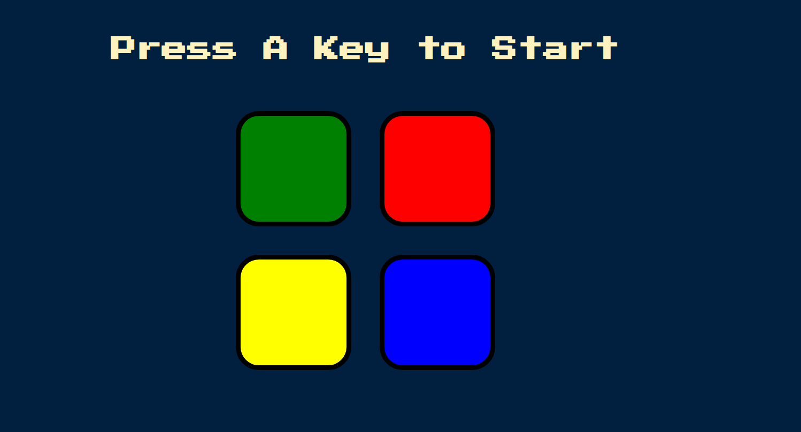
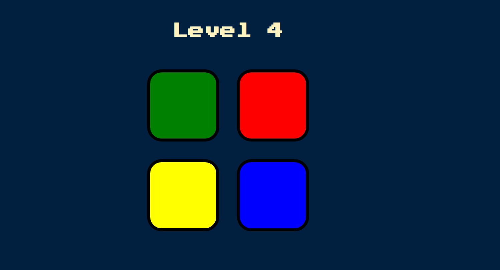

# Simon Game 🎮

This game is an interactive version of the traditional Simon Electronic Memory Game.

## Game Rules

- There are 4 distinct colour boxes (Green, Red, Yellow, Blue), and clicking each one will play a different sound.
- When you press "A ", the game will start and the boxes begin to become highlighted and randomly plays corresponding sound.
- The player then has to copy that particular sequence by manually clicking the boxes.
- If all boxes were clicked in correct sequence, the player will enter next level and have a more complex set of challenge as the game progresses to higher levels.
- Once the sequence breaks, the player will lose the game. Enjoy playing🥳

## Demo

https://harmeetsingh11.github.io/Simon-Game/

## Screenshots





## Run Locally

Clone the project

```bash
  git clone https://github.com/harmeetsingh11/Simon-Game.git
```

Go to the project directory

```bash
  cd Simon-Game
```

Start the project

```bash
  start index.html
```

## Tech Stack

- HTML5
- CSS3
- Vanilla Javascript
- jQuery

## Concepts Learned

- DOM manipulation using jQuery.
- Add Mouse, Keyboard Event listeners using jQuery.

## Acknowledgements

I'd like to express my gratitude towards Dr. Angela Yu for her Web Development course at Udemy.
